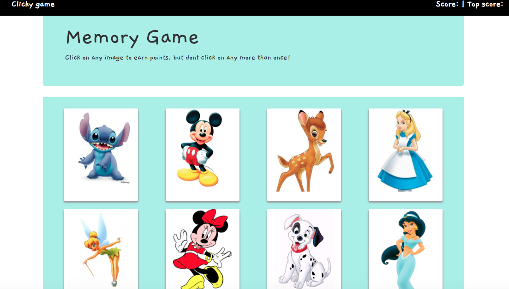

# Clicky-Game

## Overview 

This click game app is a memory game using React. The way it works is the player must be able to memorize which Disney cards they have clicked on to avoid guessing incorrectly. There are a total of 12 cards and the goal is to reach a high score of 12! Enjoy!

## Technologies used
- React
- Bootstrap
- CSS
- ES6

## App Link

## Author
**Karina Guerrero**